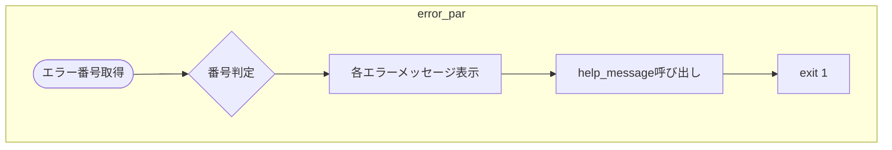
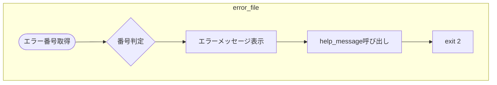

## error_par

```mermaid
flowchart TD
    subgraph error_par
        H1([エラー番号取得])
        H2{番号判定}
        H3[各エラーメッセージ表示]
        H4[help_message呼び出し]
        H5[exit 1]
        H1 --> H2 --> H3 --> H4 --> H5
    end
```

## error_file

```mermaid
flowchart TD
    subgraph error_file
        I1([エラー番号取得])
        I2{番号判定}
        I3[エラーメッセージ表示]
        I4[help_message呼び出し]
        I5[exit 2]
        I1 --> I2 --> I3 --> I4 --> I5
    end
```