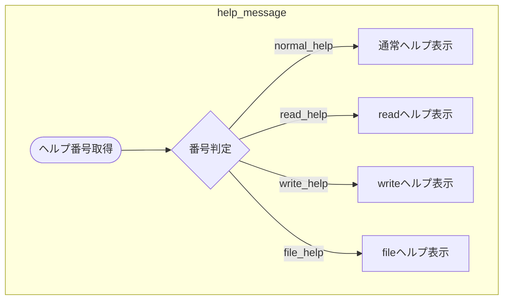

## help_message

```mermaid
flowchart TD
    subgraph help_message
        G1([ヘルプ番号取得])
        G2{番号判定}
        G3[通常ヘルプ表示]
        G4[readヘルプ表示]
        G5[writeヘルプ表示]
        G6[fileヘルプ表示]
        G1 --> G2
        G2 -- normal_help --> G3
        G2 -- read_help --> G4
        G2 -- write_help --> G5
        G2 -- file_help --> G6
    end
```
