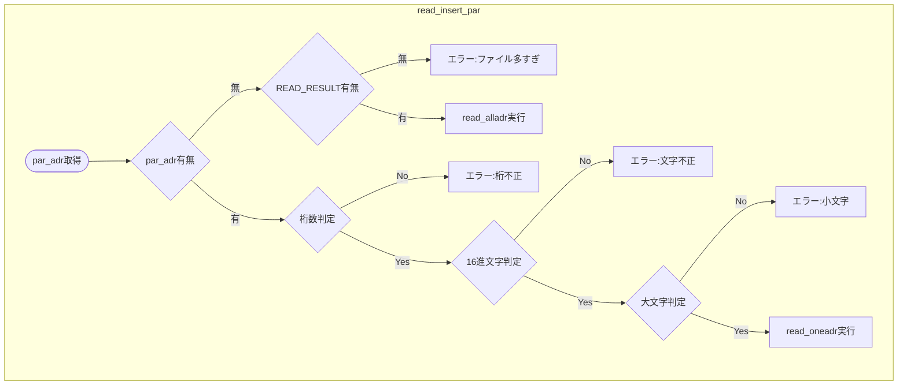
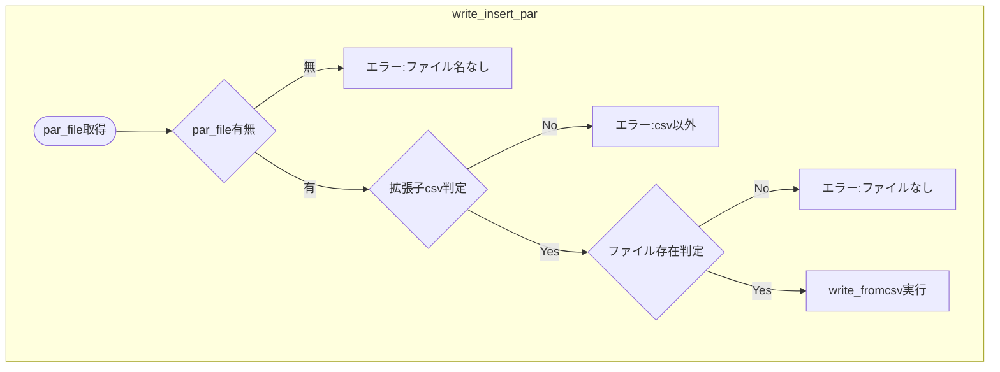

## read_insert_par

```mermaid
flowchart TD
    subgraph read_insert_par
        E1([par_adr取得])
        E2{par_adr有無}
        E3{READ_RESULT有無}
        E4[read_alladr実行]
        E5[エラー:ファイル多すぎ]
        E6{桁数判定}
        E7[エラー:桁不正]
        E8{16進文字判定}
        E9[エラー:文字不正]
        E10{大文字判定}
        E11[エラー:小文字]
        E12[read_oneadr実行]
        E1 --> E2
        E2 -- 無 --> E3
        E3 -- 無 --> E5
        E3 -- 有 --> E4
        E2 -- 有 --> E6
        E6 -- No --> E7
        E6 -- Yes --> E8
        E8 -- No --> E9
        E8 -- Yes --> E10
        E10 -- No --> E11
        E10 -- Yes --> E12
    end
```

## write_insert_par

```mermaid
flowchart TD
    subgraph write_insert_par
        F1([par_file取得])
        F2{par_file有無}
        F3[エラー:ファイル名なし]
        F4{拡張子csv判定}
        F5[エラー:csv以外]
        F6{ファイル存在判定}
        F7[エラー:ファイルなし]
        F8[write_fromcsv実行]
        F1 --> F2
        F2 -- 無 --> F3
        F2 -- 有 --> F4
        F4 -- No --> F5
        F4 -- Yes --> F6
        F6 -- No --> F7
        F6 -- Yes --> F8
    end
```