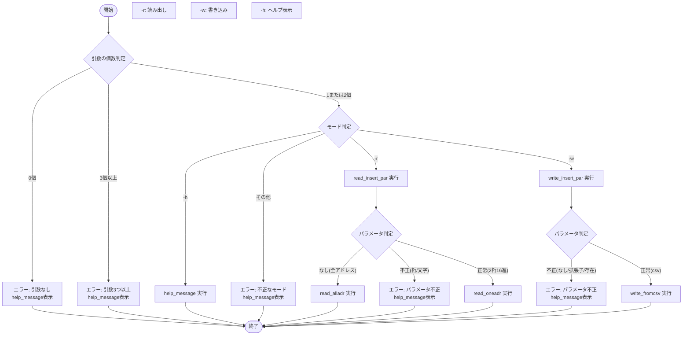

# メインフロー

```mermaid
flowchart TD
    Start([開始])
    ArgsCheck{引数の個数判定}
    ArgNone[エラー: 引数なし\nhelp_message表示]
    ArgOver[エラー: 引数3つ以上\nhelp_message表示]
    ModeCheck{モード判定}
    ModeR[-r: 読み出し]
    ModeW[-w: 書き込み]
    ModeH[-h: ヘルプ表示]
    ModeErr[エラー: 不正なモード\nhelp_message表示]
    ReadInsert[read_insert_par 実行]
    WriteInsert[write_insert_par 実行]
    Help[help_message 実行]
    End([終了])

    Start --> ArgsCheck
    ArgsCheck -- 0個 --> ArgNone --> End
    ArgsCheck -- 3個以上 --> ArgOver --> End
    ArgsCheck -- 1または2個 --> ModeCheck

    ModeCheck -- "-r" --> ReadInsert
    ModeCheck -- "-w" --> WriteInsert
    ModeCheck -- "-h" --> Help --> End
    ModeCheck -- その他 --> ModeErr --> End

    %% read_insert_par内部
    ReadInsert --> ReadParCheck{パラメータ判定}
    ReadParCheck -- なし(全アドレス) --> ReadAllAdr[read_alladr 実行]
    ReadParCheck -- 不正(桁/文字) --> ReadErr[エラー: パラメータ不正\nhelp_message表示]
    ReadParCheck -- 正常(2桁16進) --> ReadOneAdr[read_oneadr 実行]
    ReadAllAdr --> End
    ReadErr --> End
    ReadOneAdr --> End

    %% write_insert_par内部
    WriteInsert --> WriteParCheck{パラメータ判定}
    WriteParCheck -- 不正(なし/拡張子/存在) --> WriteErr[エラー: パラメータ不正\nhelp_message表示]
    WriteParCheck -- 正常(csv) --> WriteFromCsv[write_fromcsv 実行]
    WriteErr --> End
    WriteFromCsv --> End
```

