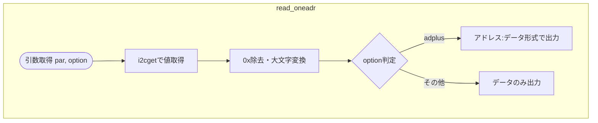
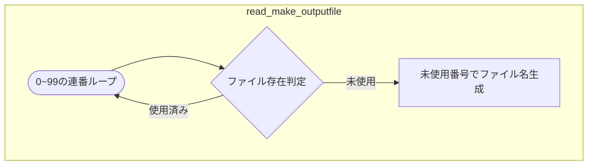
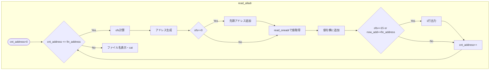

## read_oneadr

```mermaid
flowchart TD
    subgraph read_oneadr
        A1([引数取得 par, option])
        A2[i2cgetで値取得]
        A3[0x除去・大文字変換]
        A4{option判定}
        A5[アドレス:データ形式で出力]
        A6[データのみ出力]
        A1 --> A2 --> A3 --> A4
        A4 -- adplus --> A5
        A4 -- その他 --> A6
    end
```

## read_make_outputfile

```mermaid
flowchart TD
    subgraph read_make_outputfile
        B1([0~99の連番ループ])
        B2{ファイル存在判定}
        B3[未使用番号でファイル名生成]
        B1 --> B2
        B2 -- 未使用 --> B3
        B2 -- 使用済み --> B1
    end
```

## read_alladr

```mermaid
flowchart TD
    subgraph read_alladr
        C1([cnt_address=0])
        C2{cnt_address <= fin_address}
        C3[ofs計算]
        C4[アドレス生成]
        C5{ofs==0}
        C6[先頭アドレス追加]
        C7[read_oneadrで値取得]
        C8[値を横に追加]
        C9{ofs==15 or now_add==fin_address}
        C10[1行出力]
        C11[cnt_address++]
        C12[ファイル名表示・cat]
        C1 --> C2
        C2 -- Yes --> C3 --> C4 --> C5
        C5 -- Yes --> C6 --> C7
        C5 -- No --> C7
        C7 --> C8 --> C9
        C9 -- Yes --> C10 --> C11
        C9 -- No --> C11
        C11 --> C2
        C2 -- No --> C12
    end
```