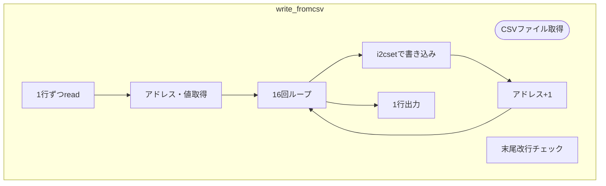

## write_fromcsv

```mermaid
flowchart TD
    subgraph write_fromcsv
        D1([CSVファイル取得])
        D2[末尾改行チェック]
        D3[1行ずつread]
        D4[アドレス・値取得]
        D5[16回ループ]
        D6[i2csetで書き込み]
        D7[アドレス+1]
        D8[1行出力]
        D3 --> D4 --> D5 --> D6 --> D7
        D7 --> D5
        D5 --> D8
    end
```
